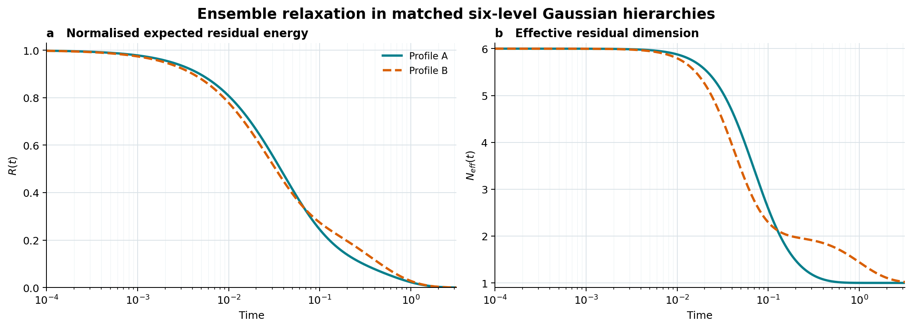

# Flagship case: dispersion in a six-level Gaussian hierarchy

[Download the `.mlab` experiment](../../examples/gaussian-hierarchy-dispersion.mlab) ·
[inspect the YAML model](../../models/gaussian-hierarchy-dispersion.yaml) ·
[view the reference results](../../examples/gaussian-hierarchy-dispersion-reference-results.json) ·
[verify file checksums](../../examples/gaussian-hierarchy-dispersion-SHA256SUMS.txt)

This case is the computational realisation of the six-level example in Section 4 of:

> Mykhailenko, M. (2026). *A scale-free measure of relaxation anisotropy in
> precision-weighted variational inference*. SSRN.
> [https://doi.org/10.2139/ssrn.5853487](https://doi.org/10.2139/ssrn.5853487)

It tests a specific claim: familiar summaries of a relaxation spectrum can be matched while its
internal shape, scale-free dispersion, and finite-time recovery remain different.

The entire analysis is declared in one Model Laboratory YAML document and executed through the
general composition capability. No model-specific Python runner, notebook, network access, or
document-supplied executable code is involved.

## Scientific question

Suppose two positive relaxation spectra have the same slowest and fastest modes. Their condition
numbers therefore agree. Suppose their geometric-mean rates also agree, fixing their common
relaxation scale. Are their remaining relaxation dynamics thereby determined?

The six-level construction gives a concrete negative answer. Profile B concentrates one additional
mode near the slowest rate and the remaining modes in a faster cluster. Profile A spreads its
interior rates more evenly. Log-spectral dispersion detects that difference, and the two profiles
then exhibit different ensemble-recovery breadths and residual dimensionalities.

## Model

The hierarchy contains one observation and six latent variables:

$$
y\mid x_1\sim\mathcal N(x_1,\pi_o^{-1}),\qquad
x_j\mid x_{j+1}\sim\mathcal N(x_{j+1},\pi_j^{-1}),\qquad
x_6\sim\mathcal N(0,\pi_p^{-1}).
$$

Ignoring terms independent of the latent state, its quadratic free energy is

$$
F(x;p)=\frac{1}{2}\pi_o(y-x_1)^2+
\frac{1}{2}\sum_{j=1}^{5}\pi_j(x_j-x_{j+1})^2+
\frac{1}{2}\pi_p x_6^2.
$$

For the Euclidean update metric, the Hessian is the positive-definite tridiagonal matrix declared
as `matrix_functions.hessian` in the [model source](../../models/gaussian-hierarchy-dispersion.yaml).
The eigenvalues $\mu_i$ of this Hessian are the contraction rates of the exact linear flow
$\dot{\delta x}=-H\delta x$.

The two reflection-symmetric precision profiles use the four-decimal values reported in Section 4
of the cited paper:

| Precision | Profile A | Profile B |
|---|---:|---:|
| $\pi_o$ | 7.3497 | 12.6953 |
| $\pi_1$ | 3.3811 | 2.5613 |
| $\pi_2$ | 5.8474 | 10.8862 |
| $\pi_3$ | 7.9421 | 0.6970 |
| $\pi_4$ | 5.8474 | 10.8862 |
| $\pi_5$ | 3.3811 | 2.5613 |
| $\pi_p$ | 7.3497 | 12.6953 |

## Declared computation

The object `matched-relaxation-profiles` is a 27-step analysis recipe. Model Laboratory validates
the complete dependency graph before executing it.

| Step family | Count | Role |
|---|---:|---|
| `matrix.evaluate` | 2 | Construct the two Hessians from the declared matrix function and precision values. |
| `matrix.generalized-eigenvalues` | 2 | Compute the positive symmetric spectra; the identity metric is implicit here. |
| `array.logspace` | 1 | Define 6,001 evaluation times from $10^{-4}$ to $10^{0.5}$. |
| `array.expression` | 18 | Derive spectral summaries, relaxation curves, effective dimensions, and recovery breadths. |
| `series.first-crossing` | 4 | Interpolate the first $R(t)\leq0.90$ and $R(t)\leq0.10$ crossings. |

Every step records its installed operation, validated settings, input identities, numerical value,
and value hash in the resulting typed artifact.

Log-spectral dispersion is

$$
D=\sqrt{\frac{1}{6}\sum_{i=1}^{6}
\left(\log\mu_i-\frac{1}{6}\sum_{k=1}^{6}\log\mu_k\right)^2}.
$$

For isotropic initial perturbations, the recipe also evaluates normalised expected residual energy

$$
R(t)=\frac{1}{6}\sum_{i=1}^{6}e^{-2\mu_i t},
$$

the logarithmic recovery breadth $W=\log(t_{0.10}/t_{0.90})$, and the covariance participation
ratio

$$
N_{\mathrm{eff}}(t)=
\frac{\left(\sum_i e^{-2\mu_i t}\right)^2}
{\sum_i e^{-4\mu_i t}}.
$$

## Results

The spectra obtained from the rounded precision profiles are:

| Profile | Relaxation rates $\mu$ |
|---|---|
| A | 1.000, 5.129, 9.482, 12.402, 15.325, 24.160 |
| B | 1.000, 1.730, 15.015, 15.094, 23.575, 24.160 |

| Quantity | Profile A | Profile B |
|---|---:|---:|
| Minimum rate | 1.000 | 1.000 |
| Geometric-mean rate | 7.789 | 7.789 |
| Maximum rate | 24.160 | 24.160 |
| Condition number | 24.160 | 24.160 |
| Log-spectral dispersion $D$ | 1.031 | 1.282 |
| $t_{0.90}$ | 0.00479 | 0.00403 |
| $t_{0.10}$ | 0.299 | 0.461 |
| Recovery ratio $t_{0.10}/t_{0.90}$ | 62.4 | 114.6 |
| Recovery breadth $W$ | 4.134 | 4.741 |
| $N_{\mathrm{eff}}(0.4)$ | 1.076 | 1.851 |

The matched quantities describe the weakest contraction, the extreme-rate ratio, and the common
rate scale. They do not describe how the four interior modes are arranged. Profile B's larger
dispersion accompanies a broader recovery interval and an approximately two-dimensional slow
residual subspace at $t=0.4$; Profile A is already close to a single remaining slow direction.

This is a constructed comparison, not a claim that dispersion alone universally determines
recovery breadth. Its purpose is to isolate information that the matched summaries omit.

*Panel a shows normalised expected residual energy. Panel b shows the effective dimension of the
residual covariance. Solid: Profile A. Dashed: Profile B.*

## Reproduce the experiment

1. Install [Model Laboratory 1.19.2 or later](https://github.com/Maksym-Mykhailenko/Model-Laboratory/releases/latest).
2. Download [`gaussian-hierarchy-dispersion.mlab`](../../examples/gaussian-hierarchy-dispersion.mlab).
3. Select **Open experiment** and choose the downloaded bundle. Opening performs integrity and
   schema inspection but does not execute the analysis.
4. Review the recorded workload and environment, then select **Reproduce**.
5. Inspect the result-by-result comparison or export the JSON/text reproduction report.

The 1.19.2 bundle includes the canonical frozen author review and opens as **Author-approved**.
It freezes `rtol = 1e-8` and `atol = 1e-11` before reproduction. On an identical numerical
environment, the expected status is `EXACT REPRODUCTION`. Across supported platforms, harmless
eigensolver rounding may instead produce `NUMERICALLY REPRODUCED`. The environment can correctly
remain `DIFFERENT`: mathematical result identity and environment identity are separate findings.

## Files and integrity

| File | Purpose |
|---|---|
| [`models/gaussian-hierarchy-dispersion.yaml`](../../models/gaussian-hierarchy-dispersion.yaml) | Human-readable model, Hessian, analysis recipe, outputs, and view specification. |
| [`examples/gaussian-hierarchy-dispersion.mlab`](../../examples/gaussian-hierarchy-dispersion.mlab) | Frozen experiment with the source, canonical Model IR, environment, provenance, Run Record, artifact, references, author review, and integrity manifest. |
| [`examples/gaussian-hierarchy-dispersion-reference-results.json`](../../examples/gaussian-hierarchy-dispersion-reference-results.json) | Compact machine-readable summary derived from the artifact in the bundle. |
| [`docs/assets/gaussian-hierarchy-dispersion.png`](../assets/gaussian-hierarchy-dispersion.png) | Publication-scale reference rendering of the two declared panels. |
| [`examples/gaussian-hierarchy-dispersion-SHA256SUMS.txt`](../../examples/gaussian-hierarchy-dispersion-SHA256SUMS.txt) | SHA-256 manifest for the model, bundle, reference JSON, figure and case page; verify from the repository root. |

The `.mlab` manifest additionally checks every member inside the container. The authoritative
full-precision numerical values are the typed artifact in that bundle; the JSON summary provides a
convenient small representation of the same reported outputs.

## Scope and limitations

- The hierarchy is linear Gaussian and the free energy is quadratic. Its local linear flow is also
  its global flow; nonlinear state dependence is not tested here.
- The update metric is the identity. The general analysis operation supports a declared
  positive-definite metric, but this case does not exercise one.
- The two precision vectors are rounded to four decimal places, so the quantities described as
  matched agree to the reported precision rather than bit-for-bit.
- No empirical observations are analysed. The case demonstrates a mathematical distinction and a
  reproducible computational implementation, not a biological or behavioural effect.
- The document invokes only installed, bounded composition operations. It does not grant a model
  file arbitrary Python, filesystem, process, or network access.

## Citation and reuse

Use [`CITATION.cff`](../../CITATION.cff) to cite Model Laboratory. Cite the scientific construction
as:

> Mykhailenko, M. (2026). *A scale-free measure of relaxation anisotropy in
> precision-weighted variational inference*. SSRN.
> [https://doi.org/10.2139/ssrn.5853487](https://doi.org/10.2139/ssrn.5853487)

The six-level hierarchy is presented in Section 4. The software, documentation, model, figure, and
checked-in example are distributed under the repository's Apache-2.0 terms unless a file states
otherwise.
